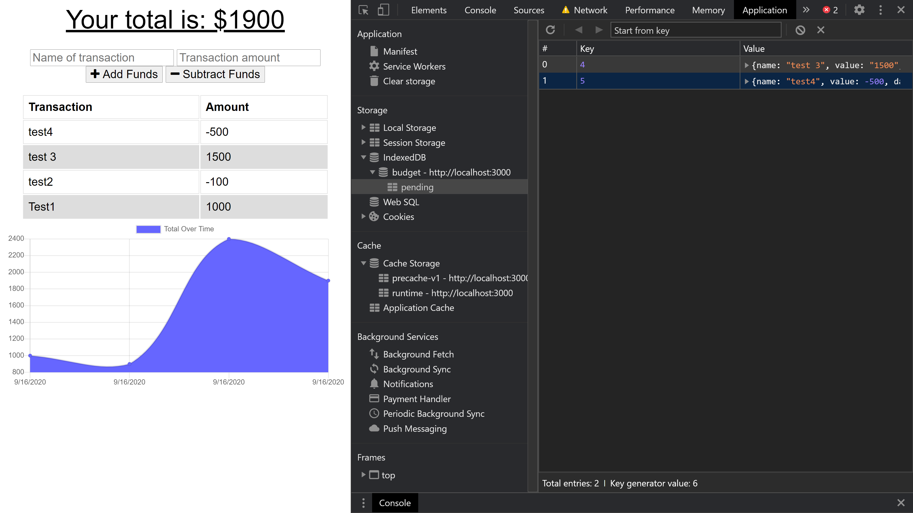
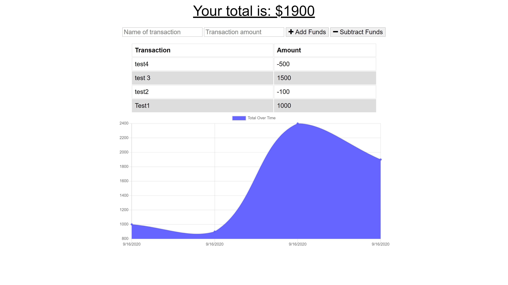

  # **PWA Online/Offline Budget Tracker**

  
  The user will be able to add expenses and deposits to their budget with or without a connection. When entering transactions offline, they should populate the total when brought back online.
 
   
  
  

  ## license
  
  

  ## Table of contents

  [Description](#Description)
  [Installation](#Installation)
  [Usage](#Usage)
  [License](#License)
  [Contributors](#Contributors)
  [Technologies](#Technologies)
  [Questions](#Questions)

  ## Installation
  
  run npm i from cli then node server.js

  ## Contributing
      
  Oscar Chiriboga
  
  
  Link to GitHub: https://github.com/cracso

  ## Technologies
  
  * Node Js
  * Express
  * Mongo DB
  * mongoose
  * Morgan(dev)
  * HTML
  * CSS

  ## Questions
  
  Email address: oscarmchiriboga@gmail.com
  
